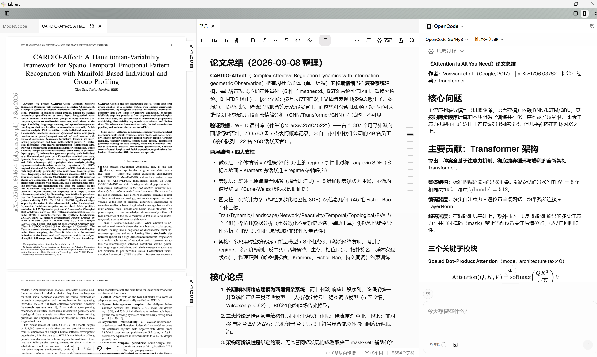
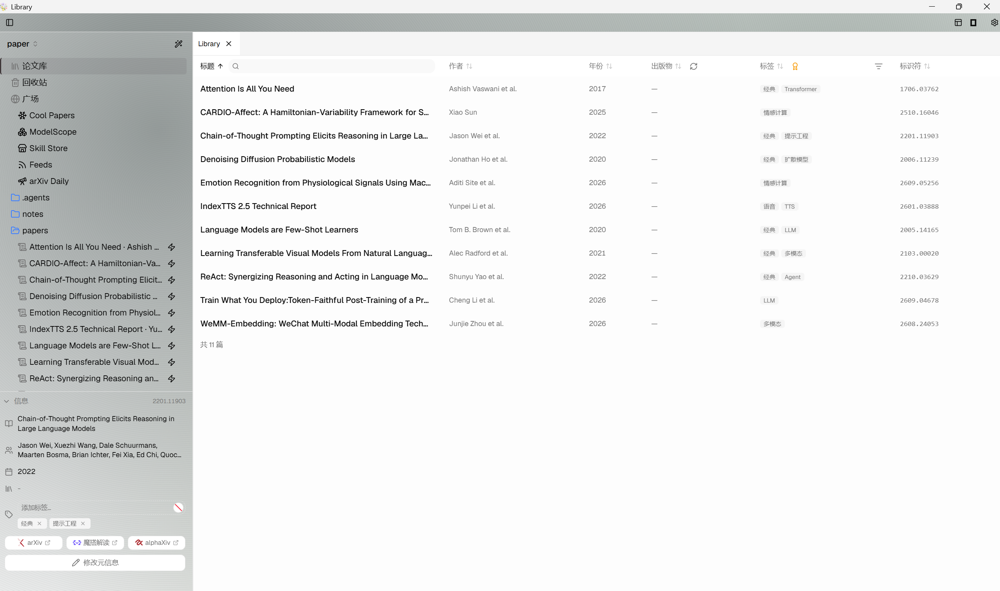
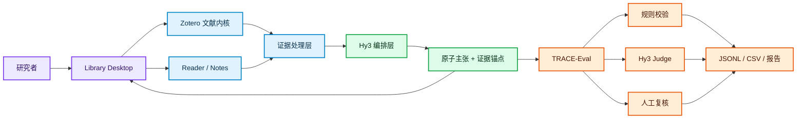

<div align="center">
  <picture>
    <source media="(prefers-color-scheme: dark)" srcset="docs/assets/readme/banner-anim.svg" />
    <source media="(prefers-color-scheme: light)" srcset="docs/assets/readme/banner-anim.svg" />
    
  </picture>
</div>

<p align="center">
  <a href="docs/2026-08-27_project-1_solution.md"></a>
  
  
  
  
</p>
<p align="center">
  <a href="https://github.com/user-A100/Library/stargazers"></a>
  <a href="https://github.com/user-A100/Library/commits"></a>
</p>

<p align="center">
  <strong><a href="#为什么是-library">为什么是 Library</a></strong> ·
  <a href="#核心能力">核心能力</a> ·
  <a href="#演示-demo">演示 Demo</a> ·
  <a href="#不只做应用也验证评测方法">评测方法</a> ·
  <a href="#系统架构">系统架构</a> ·
  <a href="#快速开始">快速开始</a> ·
  <a href="#交付路线">交付路线</a> ·
  <a href="#文档">文档</a>
</p>

> [!IMPORTANT]
> 本项目是腾讯犀牛鸟开源实践任务的个人 / 活动作品，不是腾讯的官方产品。当前仓库已接通桌面 Hy3 对话主链路，并为每次运行持久化 `library.trace/v1` 研究制品、候选主张、证据定位与哈希校验；候选主张已支持接受、驳回、修改、证据重绑及追加式决策记录。**面向大赛的 7 维评测与有效性验证已交付**（判别力、跨厂商 judge 一致性、对抗性实验均完成），完整材料见 [`evaluation/`](evaluation/README.md)。

##  为什么是 Library

普通论文助手往往止步于“PDF 旁边的聊天框”：答案很流畅，但用户仍要自己翻页寻找依据。Library 把一次 AI 回答拆成可验证的研究动作：

```text
选择论文 → 限定来源 → Hy3 拆解原子主张 → 绑定页码与原文
        → 一键回页核验 → 接受 / 驳回 / 修改 → 保存研究笔记
                                      ↓
                                  TRACE-Eval
```

|  传统论文助手 |  Library |
| --- | --- |
| 文末给出模糊参考资料 | 关键主张逐条绑定论文、页码与原文 |
| 回答与文库彼此分离 | Reader、标注、笔记与 AI 位于同一桌面工作流 |
| 出错后整体重新生成 | 主张级接受、驳回、修改与审计记录 |
| 只展示几个漂亮案例 | 31 个用例 + 7 维 rubric + 判别力 / 一致性 / 对抗性实验 |
| 只评价模型答案 | 同时验证评测器的判别力、一致性与抗投机能力 |

##  核心能力

| 模块 | 能力 | 当前状态 |
| --- | --- | --- |
|  Evidence Library | 本地文库、集合、条目、附件、标签与 SQLite 数据层 |  |
|  Grounded Reader | PDF 阅读、选区提问、Markdown 回答与研究笔记 |  |
|  Hy3 Research Copilot | OpenAI-compatible 流式调用、来源限定、混合检索、引用审计与 `/` 命令 |  |
|  Plaza 论文发现 | ModelScope / Cool Papers / arXiv Daily 内嵌面板、面板内 AI 助手、推荐卡片一键跳转与 `library-cli plaza` 命令（开箱即用） |  |
|  Claim-level Evidence | 证据定位契约、逐条回页，以及接受 / 驳回 / 修改 / 重绑的人工复核闭环；引用协议经评测 47/47 块级机器验证，伪引用可被规则层识别 |  |
|  TRACE-Eval | 制品结构、引用白名单和哈希一致性预检；大赛 7 维评测与有效性验证已交付 |  |
|  Focus Workspace | 侧栏优先、分屏研究、浅色/深色与动态主题 |  |
|  Zotero Plugin Host | AddonManager、ItemPane、Reader 与标准 XPI 生命周期 |  |

##  演示 Demo

<div align="center">
  
  
  <br /><sub>左：论文库总览 · 右：文献阅读 + 自动笔记 + AI 面板（完整视频：<a href="evaluation/demo/demo-2x.mp4">demo-2x.mp4 · 90 秒</a>）</sub>
</div>

视频展示完整链路：ModelScope 找论文 → 导入库 → 就库内论文提问（引用绑定页码）→ 自动写结构化阅读笔记。

##  不只做应用，也验证评测方法

项目选择犀牛鸟混元大语言模型**项目一：开放式场景 AI 应用与评判标准设计**。TRACE-Eval 覆盖八个可操作维度：

<div align="center">
  
</div>

三条硬失败规则防止总分掩盖关键问题：**伪造引用**、**关键主张大面积无证据**、**密钥泄露或越权操作**。

### 已交付的评测与有效性验证

应用内 TRACE-Eval 之外，面向大赛的完整评测材料已在 [`evaluation/`](evaluation/README.md) 交付并验证：

| 维度 | 结果 | 判定层 |
| --- | --- | --- |
| 便捷性（找→导→问→笔记） | 全链路跑通，plaza 600 条论文 2.33s | 脚本计时 |
| 可追溯性 | **47/47 引用 100%** 块级+页码机器可验证 | 规则层全自动 |
| 忠实性 | 双厂商 judge 分数级 **6/6 一致**（极差 0） | LLM-as-judge 交叉 |
| 术语正确性 | 28 份回答 0 译名漂移（18 条术语表） | 规则层全自动 |
| 安全性 | 反例拒答 **6/6**，对抗断言 **9/9** | 规则层全自动 |
| 规范性 | 结构化笔记 6/6 格式检查 | 规则层全自动 |
| 资源占用 | 启动 0.01s · plaza 22.1MB · 输出 846B | 外部采样实测 |

有效性实验：好/中/差回答严格排序（判别力 ✅）、跨厂商独立评审 6/6 分数一致（一致性 ✅）、伪引用/术语堆砌/篇幅灌水三个作弊样本全部被抓住（对抗性 ✅）。失败模式与能力边界分析见[分析报告](evaluation/analysis-report.md)。

> [!NOTE]
> 当前应用内自动化只判定制品结构、引用 ID、来源范围与内容哈希是否一致。界面中的主张均标记为“候选主张 / 语义支持尚未评估”；人工“接受”只代表用户复核决定，不等价于自动证明论文证据支持模型结论。修改与重绑以追加式记录保存，原始模型回答不会被覆盖。

完整评分阈值、120 个任务的数据设计和统计指标见[方案文档](docs/2026-08-27_project-1_solution.md)。

##  系统架构



正式桌面端以 Zotero `9.0.6` 的 Gecko 运行时为内核，保留本地文库、SQLite、Reader、Note Editor、CSL、translators、Connector Server 与原生 XPI 生命周期。根目录 React/Vite 应用用于快速验证视觉与交互，不承担正式插件宿主职责。

##  快速开始

### 环境要求

- Windows 11、WSL2 Ubuntu 22.04
- Git、Git LFS、Node.js 22
- 可访问的 Hy3 OpenAI-compatible endpoint（AI 功能）

### 获取代码

```powershell
git clone --recurse-submodules https://github.com/user-A100/Library.git
cd Library
npm ci
```

### 配置 AI

复制 `.env.example` 为 `.env.local`，只在本地填写密钥。接口地址和模型名在应用的 AI 设置中选择；Hy3 使用“自定义兼容接口”。不要提交真实密钥。

```dotenv
CUSTOM_AI_API_KEY=your_hy3_api_key
# 也可使用通用兜底变量：AI_API_KEY=your_hy3_api_key
```

### 运行与验证

```powershell
# 运行 React 交互原型
npm run dev

# 运行契约测试并执行生产构建
npm run verify

# 构建、启动和验证桌面端
npm run desktop:addon
npm run desktop:translate
npm run desktop:notes
npm run desktop:build
npm run desktop:run
npm run desktop:verify
```

桌面产物位于 `desktop/dist/Zotero_win-x64/Library.exe`。

Library 桌面端内置 [Translate for Zotero](https://github.com/windingwind/zotero-pdf-translate)
2.4.7：打开 PDF、EPUB 或网页后选中文本，译文会直接显示在原生选择弹窗和条目侧栏。
中文界面首次启动默认使用免密钥的 CNKI 服务；可在 `编辑 → 设置 → Translate` 中切换
目标语言、关闭自动翻译，或配置 DeepL、Google、GPT 等其他服务。构建使用固定版本与
SHA-256，许可证和对应源码信息随桌面产物一同分发。

> [!IMPORTANT]
> 自动翻译会把所选文本发送到当前翻译服务。请勿选中敏感内容；需要密钥的服务由该
> 上游组件保存在 Zotero 首选项中，不要复用高价值账户密钥。若希望每次确认后再发送，
> 请在 `编辑 → 设置 → Translate → General` 关闭 `Automatically Translate Selection`。

Library 桌面端还内置 **Library Notes**（基于
[Better Notes 3.3.3](https://github.com/windingwind/zotero-better-notes/tree/v3.3.3)）：
在原生笔记编辑器中提供笔记链接、模板、Markdown 模式、Markdown 双向自动同步、
同步冲突比较，以及 Markdown、DOCX、PDF、思维导图等导出能力。构建过程会校验固定
上游 XPI，再应用 Library 名称、图标、偏好前缀、更新策略和可见文案；底层笔记 ABI
与 `zotero://note` 链接协议保持兼容。扩展清单、偏好前缀和更新入口使用 Library 的
独立身份。修改版继续按 AGPLv3-or-later 分发，许可证、固定源码提交和 Library 修改
说明随桌面产物提供。

Library 桌面构建禁用 Zotero 上游应用更新通道，避免官方更新包覆盖 Library 品牌资源
与内置组件；版本升级由 Library 自己的发布流程统一提供。

> [!TIP]
> 若已有 Zotero 占用 `23119`，可给启动与验证脚本传入 `-ConnectorPort 23120`。

##  项目结构

```text
Library/
├── desktop/
│   ├── zotero/                     # Zotero 9.0.6 固定内核（submodule）
│   ├── addons/research-workspace/ # 原生研究工作台 XPI
│   ├── third-party/               # 内置翻译与 Library Notes 的版本锁、许可和修改说明
│   └── assets/                     # Library 品牌资源
├── connector/library-connector/   # 浏览器 Connector（submodule）
├── src/                            # React / TypeScript 交互原型
├── schemas/                        # AI 研究制品 JSON Schema
├── tests/                          # 契约、回放与性质测试
├── scripts/                        # 构建、启动、品牌化与验收脚本
├── fixtures/                       # 可公开的解析样例
├── public/papers/                  # 演示论文
├── evaluation/                     # 大赛评测材料：样本、脚本、结果、有效性验证与分析报告
└── docs/                           # 方案、架构与交付报告
```

##  交付路线

| 阶段 | 日期 | 交付 | 状态 |
| --- | --- | --- | --- |
| M0 方案冻结 | 8/27 | 场景、架构、rubric、数据规范 |  |
| M1–M2 产品闭环 | 8/28–9/5 | Hy3 结构化生成、证据锚点、回页与纠错、广场论文发现与面板 AI 助手 |  |
| M3–M4 评测与数据 | 9/6–9/8 | 7 维 rubric、31 用例样本集、规则层 + 双厂商 judge 评测脚本 |  |
| M5 有效性实验 | 9/8 | 判别力（好>中>差）、跨厂商一致性（6/6 极差 0）、对抗性（3 作弊样本全抓住） |  |
| M6–M7 发布 | 9/8–9/23 | 结果报告 ✅、README ✅、90 秒 demo ✅、复现验收与最终提交通道 |  |

##  文档

- [项目一完整方案：设计思路、架构、技术、评测与时间规划](docs/2026-08-27_project-1_solution.md)
- [评测材料索引（样本集 / 脚本 / 结果表格 / 有效性验证）](evaluation/README.md)
- [评测材料有效性验证结果分析报告](evaluation/analysis-report.md)
- [产品与评测蓝图](docs/product-blueprint.md)
- [桌面内核与插件兼容说明](docs/desktop-kernel.md)
- [桌面端阶段性交付记录](docs/2026-08-25_handoff-Library-K3-report.md)

##  安全、许可与商标

- API Key 仅通过环境变量或本地配置传入；`.env` 已被 Git 忽略；
- 默认最小化发送论文片段，并显示本次调用使用的来源范围；
- Zotero 源码按 AGPLv3 分发，衍生桌面源码需履行对应源码提供义务；
- 产品使用 **Library** 品牌，不宣称与腾讯、Zotero 或 Zen Browser 官方存在隶属或背书关系。

##  致谢

- [Tencent-Hunyuan/Hy3](https://github.com/Tencent-Hunyuan/Hy3)
- [zotero/zotero](https://github.com/zotero/zotero)
- [zotero/zotero-connectors](https://github.com/zotero/zotero-connectors)
- [Lucide](https://lucide.dev) — README 使用的开源图标（ISC 许可）

---

<div align="center">
  <strong>Ground every claim. Trace every source. Learn from every correction.</strong>
  <br /><br />
  <a href="#readme">回到顶部 ↑</a>
</div>
