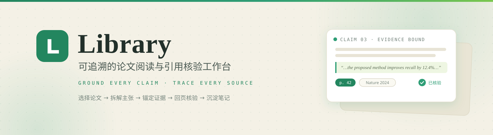
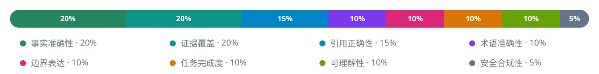
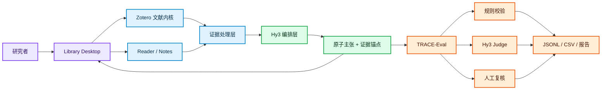

<div align="center">
  <picture>
    <source media="(prefers-color-scheme: dark)" srcset="docs/assets/readme/banner-dark.svg" />
    <source media="(prefers-color-scheme: light)" srcset="docs/assets/readme/banner-light.svg" />
    
  </picture>
</div>

<p align="center">
  <a href="docs/2026-08-27_project-1_solution.md"></a>
  
  
  
  
</p>
<p align="center">
  <a href="https://github.com/user-A100/Library/stargazers"></a>
  <a href="https://github.com/user-A100/Library/commits"></a>
</p>

<p align="center">
  <strong><a href="#为什么是-library">为什么是 Library</a></strong> ·
  <a href="#核心能力">核心能力</a> ·
  <a href="#不只做应用也验证评测方法">评测方法</a> ·
  <a href="#系统架构">系统架构</a> ·
  <a href="#快速开始">快速开始</a> ·
  <a href="#交付路线">交付路线</a> ·
  <a href="#文档">文档</a>
</p>

> [!IMPORTANT]
> 本项目是腾讯犀牛鸟开源实践任务的个人 / 活动作品，不是腾讯、Zotero 或 Zen Browser 的官方产品。当前仓库包含可运行桌面内核、原生研究插件和交互原型；Hy3 主张级证据链与 TRACE-Eval 正按[项目方案](docs/2026-08-27_project-1_solution.md)继续实现。

##  为什么是 Library

普通论文助手往往止步于“PDF 旁边的聊天框”：答案很流畅，但用户仍要自己翻页寻找依据。Library 把一次 AI 回答拆成可验证的研究动作：

```text
选择论文 → 限定来源 → Hy3 拆解原子主张 → 绑定页码与原文
        → 一键回页核验 → 接受 / 驳回 / 修改 → 保存研究笔记
                                      ↓
                                  TRACE-Eval
```

|  传统论文助手 |  Library |
| --- | --- |
| 文末给出模糊参考资料 | 关键主张逐条绑定论文、页码与原文 |
| 回答与文库彼此分离 | Reader、标注、笔记与 AI 位于同一桌面工作流 |
| 出错后整体重新生成 | 主张级接受、驳回、修改与审计记录 |
| 只展示几个漂亮案例 | 120 个任务 + 8 维 rubric + 有效性实验 |
| 只评价模型答案 | 同时验证评测器的判别力、一致性与抗投机能力 |

##  核心能力

| 模块 | 能力 | 当前状态 |
| --- | --- | --- |
|  Evidence Library | 本地文库、集合、条目、附件、标签与 SQLite 数据层 |  |
|  Grounded Reader | PDF 阅读、选区提问、Markdown 回答与研究笔记 |  |
|  Hy3 Research Copilot | 长上下文理解、主张拆解、跨文献综合、`/` 斜杠命令 |  |
|  Claim-level Evidence | `itemKey + page + quote + offsets` 证据锚点 |  |
|  TRACE-Eval | 规则 + Hy3 Judge + 人工复核的 8 维评测 |  |
|  Focus Workspace | 侧栏优先、分屏研究、浅色/深色与动态主题 |  |
|  Zotero Plugin Host | AddonManager、ItemPane、Reader 与标准 XPI 生命周期 |  |

##  不只做应用，也验证评测方法

项目选择犀牛鸟混元大语言模型**项目一：开放式场景 AI 应用与评判标准设计**。TRACE-Eval 覆盖八个可操作维度：

<div align="center">
  
</div>

三条硬失败规则防止总分掩盖关键问题：**伪造引用**、**关键主张大面积无证据**、**密钥泄露或越权操作**。评测器将通过判别力、人工一致性、重复稳定性、对抗性与消融实验验证。

完整评分阈值、120 个任务的数据设计和统计指标见[方案文档](docs/2026-08-27_project-1_solution.md)。

##  系统架构



正式桌面端以 Zotero `9.0.6` 的 Gecko 运行时为内核，保留本地文库、SQLite、Reader、Note Editor、CSL、translators、Connector Server 与原生 XPI 生命周期。根目录 React/Vite 应用用于快速验证视觉与交互，不承担正式插件宿主职责。

##  快速开始

### 环境要求

- Windows 11、WSL2 Ubuntu 22.04
- Git、Git LFS、Node.js 22
- 可访问的 Hy3 OpenAI-compatible endpoint（AI 功能）

### 获取代码

```powershell
git clone --recurse-submodules https://github.com/user-A100/Library.git
cd Library
npm install
```

### 配置 AI

复制 `.env.example` 为 `.env.local`，只在本地填写密钥。接口地址和模型名在应用的 AI 设置中选择；Hy3 使用“自定义兼容接口”。不要提交真实密钥。

```dotenv
CUSTOM_AI_API_KEY=your_hy3_api_key
# 也可使用通用兜底变量：AI_API_KEY=your_hy3_api_key
```

### 运行与验证

```powershell
# 运行 React 交互原型
npm run dev

# 构建、启动和验证桌面端
npm run desktop:build
npm run desktop:run
npm run desktop:verify
```

桌面产物位于 `desktop/dist/Zotero_win-x64/Library.exe`。

> [!TIP]
> 若已有 Zotero 占用 `23119`，可给启动与验证脚本传入 `-ConnectorPort 23120`。

##  项目结构

```text
Library/
├── desktop/
│   ├── zotero/                     # Zotero 9.0.6 固定内核（submodule）
│   ├── addons/research-workspace/ # 原生研究工作台 XPI
│   └── assets/                     # Library 品牌资源
├── connector/library-connector/   # 浏览器 Connector（submodule）
├── src/                            # React / TypeScript 交互原型
├── scripts/                        # 构建、启动、品牌化与验收脚本
├── fixtures/                       # 可公开的解析样例
├── public/papers/                  # 演示论文
└── docs/                           # 方案、架构与交付报告
```

##  交付路线

| 阶段 | 日期 | 交付 | 状态 |
| --- | --- | --- | --- |
| M0 方案冻结 | 8/27 | 场景、架构、rubric、数据规范 |  |
| M1–M2 产品闭环 | 8/28–9/5 | Hy3 结构化生成、证据锚点、回页与纠错 |  |
| M3–M4 评测与数据 | 9/6–9/15 | TRACE-Eval、120 个任务、人工标注 |  |
| M5 有效性实验 | 9/16–9/19 | 判别力、一致性、稳定性、对抗与消融 |  |
| M6–M7 发布 | 9/20–9/23 | 结果报告、README、2 分钟 demo、复现验收 |  |

##  文档

- [项目一完整方案：设计思路、架构、技术、评测与时间规划](docs/2026-08-27_project-1_solution.md)
- [产品与评测蓝图](docs/product-blueprint.md)
- [桌面内核与插件兼容说明](docs/desktop-kernel.md)
- [桌面端阶段性交付记录](docs/2026-08-25_handoff-Library-K3-report.md)

##  安全、许可与商标

- API Key 仅通过环境变量或本地配置传入；`.env` 已被 Git 忽略；
- 默认最小化发送论文片段，并显示本次调用使用的来源范围；
- Zotero 源码按 AGPLv3 分发，衍生桌面源码需履行对应源码提供义务；
- 产品使用 **Library** 品牌，不宣称与腾讯、Zotero 或 Zen Browser 官方存在隶属或背书关系。

##  致谢

- [Tencent-Hunyuan/Hy3](https://github.com/Tencent-Hunyuan/Hy3)
- [zotero/zotero](https://github.com/zotero/zotero)
- [zotero/zotero-connectors](https://github.com/zotero/zotero-connectors)
- [Lucide](https://lucide.dev) — README 使用的开源图标（ISC 许可）

---

<div align="center">
  <strong>Ground every claim. Trace every source. Learn from every correction.</strong>
  <br /><br />
  <a href="#readme">回到顶部 ↑</a>
</div>
