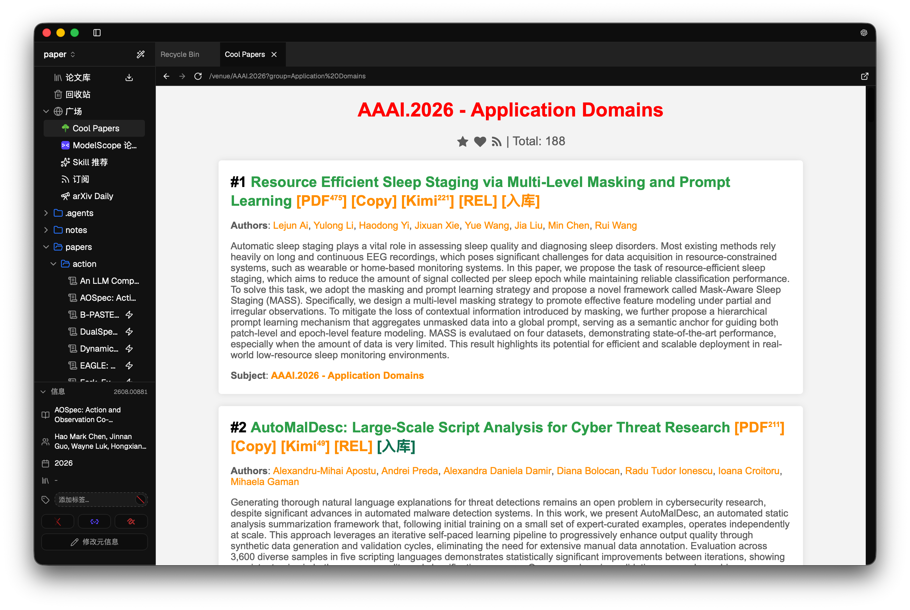
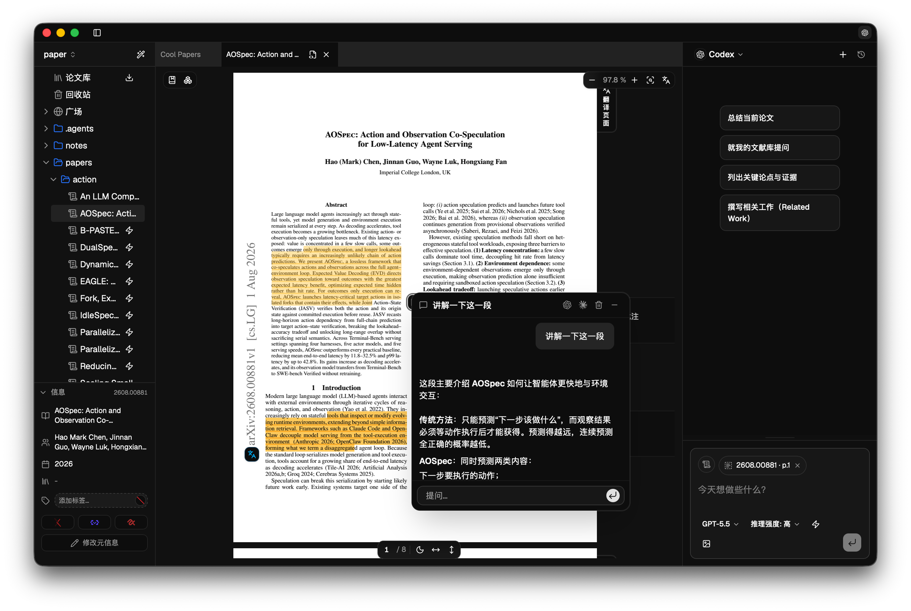
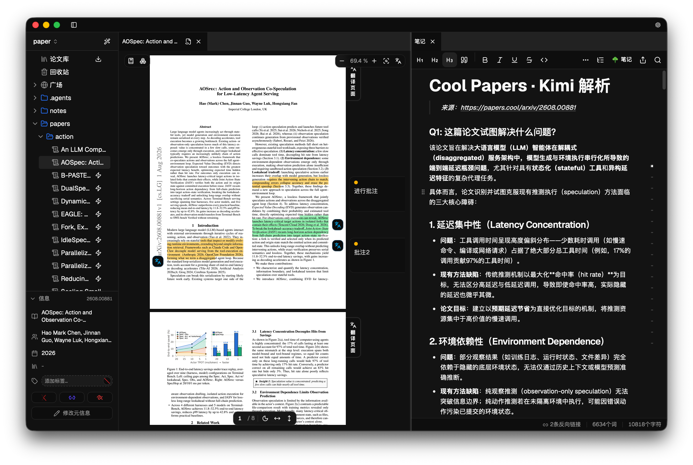
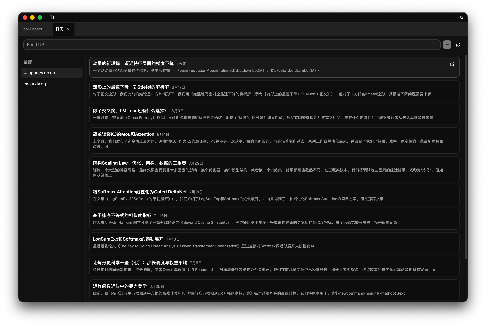
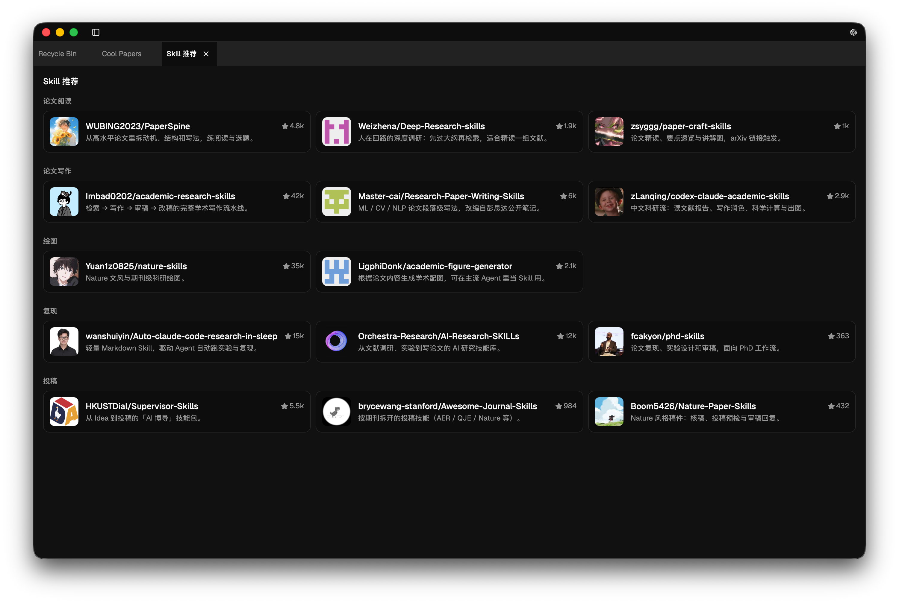
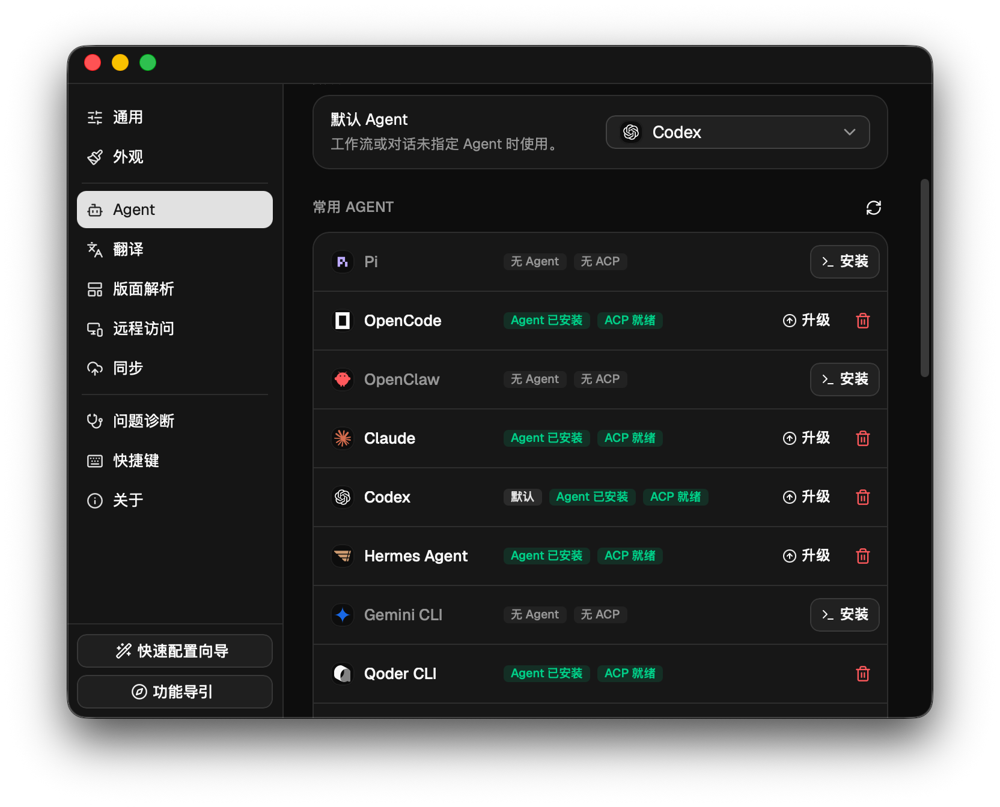
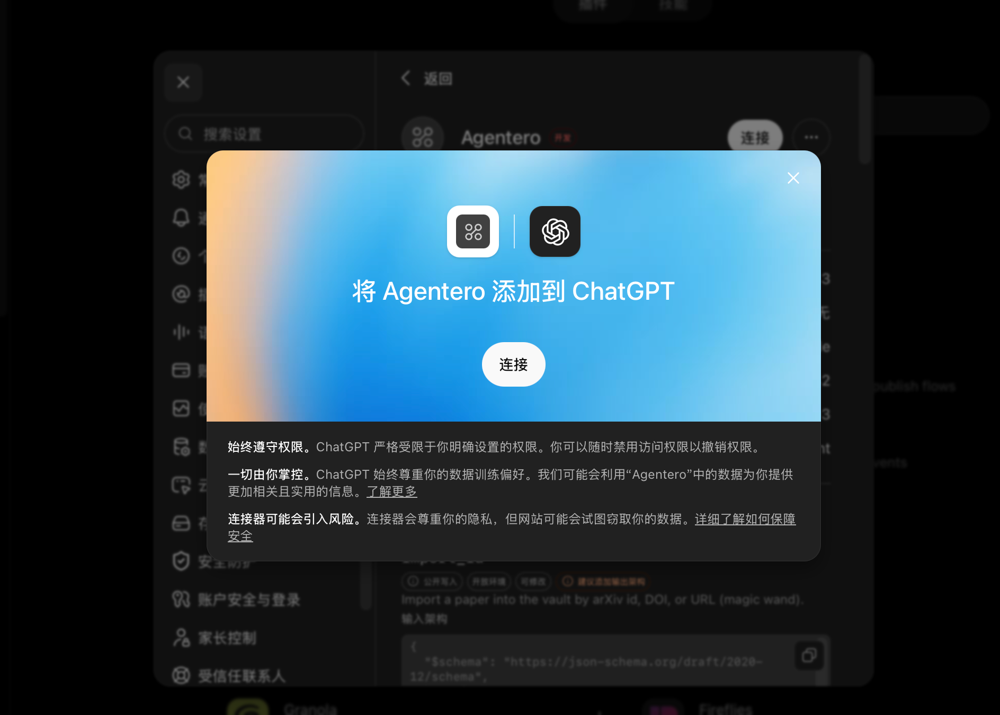
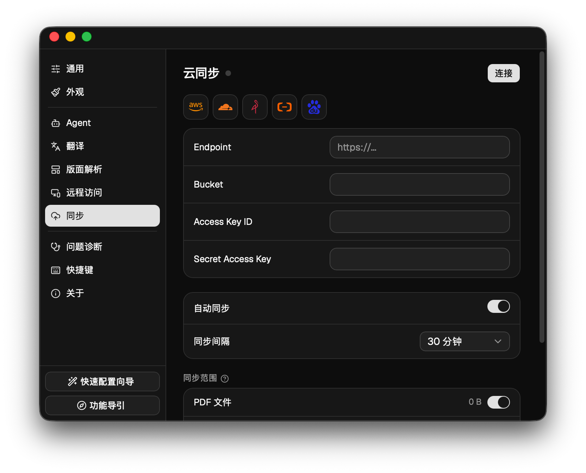
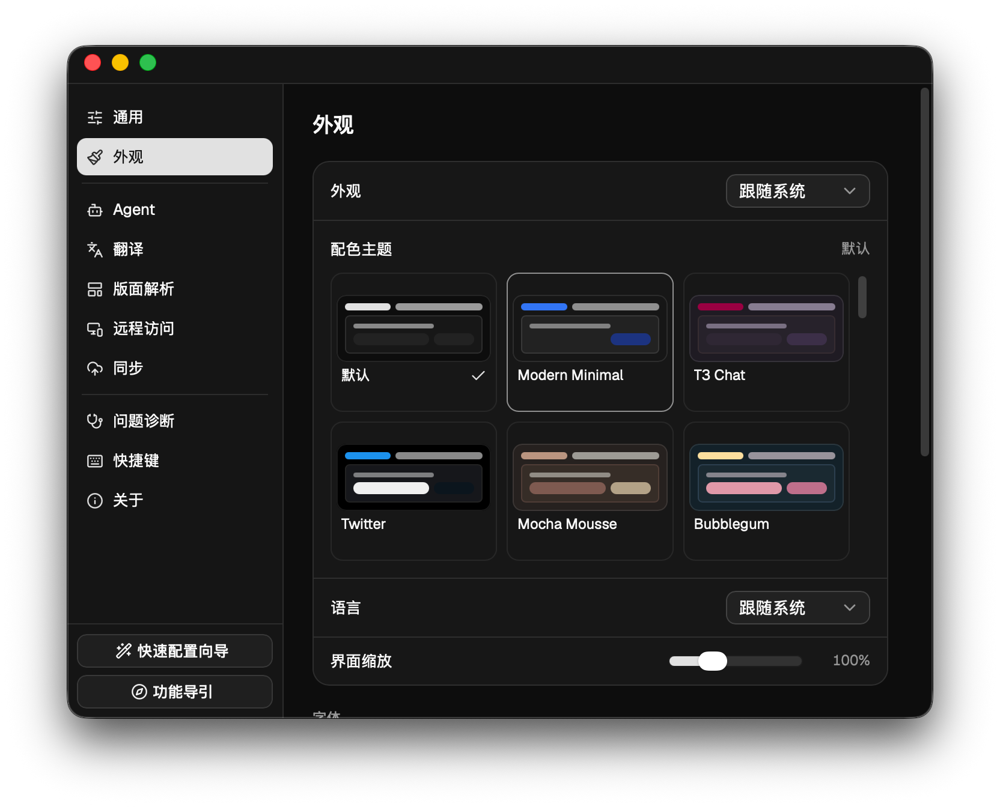

<p align="center">
  
</p>

<p align="center">
  <a href="https://github.com/poco-ai/agentero/stargazers"></a>
  <a href="https://github.com/poco-ai/agentero/network/members"></a>
  <a href="https://github.com/poco-ai/agentero/issues"></a>
  <a href="https://github.com/poco-ai/agentero/pulls"></a>
  <a href="LICENSE"></a>
  <a href="https://github.com/poco-ai/agentero/releases"></a>
  <a href="https://agentero-docs.poco-ai.com"></a>
</p>

<p align="center">
  <a href="README.md">中文</a> | English
</p>

If this project helps you, please **give it a star** on GitHub!

<p align="center">
  <a href="https://github.com/poco-ai/agentero/stargazers"></a>
</p>

**Context is everything**.

If today's models are $f$ — smarter and more alike than ever — then what determines their output $y$ is the input $x$, namely the context.

Yet research context today is fragmented: PDFs and highlights live in Zotero, notes in Obsidian, and your discussions with AI in chat windows. These pieces don't talk to each other, so even the smartest agent can only see fragments.

That's why we built **Agentero**: an agent-friendly, agent-native way of managing references, exploring how humans and agents can collaborate in literature management.

Agentero is a local-first research workbench for the agent era, with AI participating in input, processing, and output. It does not lock you into a specific agent or model — connect your own local agent via **ACP** (BYOA), and keep your working context in your local Vault.

## Features

- **Agent-native experience**
  - Connect your local agent via **ACP**. Agentero does not lock you into any specific agent or model, and your working context stays in the local Vault.
  - Quickly install, configure, and uninstall agents.
  - Selection-based chat, paper import, and Skill import let agents take part in search, reading, and organization workflows.
  - Built-in CLI for importing papers, fetching metadata, writing notes, managing highlights, and more.
  - Built-in MCP lets you expose Agentero capabilities to ChatGPT and other external clients.
- **Zotero ecosystem bridge**: compatible with Zotero-style import paths — save papers from identifiers, links, or the browser extension. Import a Zotero library in one click, keeping tags, notes, and attachments. Export BibTeX / BibLaTeX anytime to plug into your LaTeX writing flow.
- **Paper import**
  - Browse the [Cool Papers](https://papers.cool/) site inside the app and import papers.
  - Import papers from ModelScope.
  - Subscribe to RSS feeds.
  - Get daily arXiv recommendations based on your existing library.
  - Search by paper title to import.
  - Import papers via the Zotero browser extension.
- **Library management**
  - Fetch publisher information for papers in your library and discover new papers that cite them.
  - Parse a paper's references and import them with one click.
  - Tags and filters for organizing your library.
  - Quick jump to the corresponding arXiv or alphaXiv page.
- **Reading and note-taking**
  - WYSIWYG Markdown note editor.
  - Obsidian-style `[[wikilinks]]` and `/` slash commands.
  - One-click, page-level, and selection-based translation, with multiple free APIs and bring-your-own-key API support.
  - Page navigation, fit-width/fit-page, outline, ⌘F search, smooth text selection, highlights, annotations, Q&A, and translation.
  - Parse figures, tables, formulas, and algorithms in context.
- **Cloud sync**: sync your Vault with S3-compatible cloud storage.
- **Remote access**: browse remote knowledge bases over an SSH tunnel — data stays on your own server.
- **Cross-platform**: Mac, Windows, and Linux, with shortcuts aligned with common software so your habits carry over.
- **Multiple themes**: several theme styles to match different preferences.

## Screenshots

<p align="center">
  
  <br/>
  <sub>Browse Cool Papers inside the app and import papers in one click</sub>
</p>

<p align="center">
  
  <br/>
  <sub>Split-view PDF reading with an Agent panel for summaries, Q&A, and translation</sub>
</p>

<p align="center">
  
  <br/>
  <sub>Selection and page-level translation alongside Markdown notes</sub>
</p>

<p align="center">
  
  <br/>
  <sub>Subscribe to RSS feeds to track the latest papers and posts</sub>
</p>

<p align="center">
  
  <br/>
  <sub>Install community Skills to extend reading, writing, and research workflows</sub>
</p>

<p align="center">
  
  <br/>
  <sub>Connect local agents via ACP, install, upgrade, and set your default agent</sub>
</p>

<p align="center">
  
  <br/>
  <sub>Built-in MCP lets you expose Agentero capabilities to ChatGPT and other clients</sub>
</p>

<p align="center">
  
  <br/>
  <sub>Configure S3-compatible storage to sync your Vault across devices</sub>
</p>

<p align="center">
  
  <br/>
  <sub>Multiple color themes with system-aware appearance and UI zoom</sub>
</p>

## Quick Start

### Desktop app

Download from [Agentero](https://agentero.poco-ai.com) or [Releases](https://github.com/poco-ai/agentero/releases).

Linux requires Ubuntu **22.04+** (webkit2gtk 4.1). See the [installation docs](docs/usage/getting-started.md).

HomeBrew

```bash
brew tap poco-ai/agentero
brew install --cask agentero
```

### CLI

HomeBrew

```bash
brew tap poco-ai/agentero
brew install agentero
```

## Development

### Project structure

```text
agentero/
├── AGENTS.md             # Repo guide for agents / developers
├── mkdocs.yml            # MkDocs site config
├── src/                  # React + TypeScript frontend
├── src-tauri/            # Tauri 2 + Rust host (Vault, Wiki, ACP)
├── cli/                  # Headless CLI (bin agentero; see docs/backend/cli.md)
├── templates/vault/      # Create Vault scaffold (incl. .agents/skills)
├── docs/                 # MkDocs: usage / frontend / backend / development (drafts)
└── package.json
```

### Tech stack

<p align="center">
  
  
  
  
  
</p>

- **Desktop shell**: [Tauri 2](https://v2.tauri.app/)
- **Frontend**: [React](https://react.dev/), [TypeScript](https://www.typescriptlang.org/), [Tailwind CSS](https://tailwindcss.com/), [shadcn/ui](https://ui.shadcn.com/), [AI Elements](https://elements.ai-sdk.dev/)
- **Window management**: Dockview
- **PDF**: Embedded PDF
- **Editor**: [Plate](https://platejs.org/) / Markdown
- **Agent**: [Agent Client Protocol](https://agentclientprotocol.com/), BYOA

### Getting started

```bash
git clone https://github.com/poco-ai/agentero.git
cd agentero
pnpm install

# Clean frontend and Rust build artifacts
pnpm clean

# Desktop app (recommended)
pnpm tauri dev

# Frontend-only preview (no native Vault / Agent backend)
pnpm dev
```

## Contributing

Issues and PRs are welcome.

1. Fork the repo and create a feature branch.
2. Keep changes focused and follow the existing lint/format setup (`pnpm lint` / `pnpm format`).
3. Describe what the PR changes and why in the PR description.

For larger ideas, open an issue first to align on scope.

## License

This project is licensed under the [MIT License](LICENSE).

## Star History

[](https://www.star-history.com/?type=date&repos=poco-ai%2Fagentero)

## Acknowledgements

Thanks to the [LinuxDo](https://linux.do/) and [ModelScope](https://modelscope.cn/) communities for their support and feedback.
