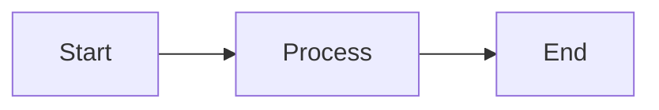

# Markdown 编辑

Plate WYSIWYG；用于普通笔记与论文 `NOTES.md`。磁盘上始终是标准 Markdown，保证 Vault 可被 Obsidian / VS Code 打开。

## 技术选型

| 库 | 用途 |
|---|---|
| `@platejs/*` 插件体系 | 基于某种 Slate 模型的富文本编辑 |
| `@platejs/markdown` | Markdown ↔ 编辑器文档 序列化 |
| `prettier/standalone` + `prettier/plugins/markdown` | 用户显式触发的整篇 Markdown 格式整理；首次使用时按需加载 |
| `@platejs/media` 等 | 图片等节点 |
| `@platejs/selection` + `@platejs/dnd` | 仅 live editor：块选与拖拽换位；内部块 id 不写盘 |
| 自定义双链插件 | `[[...]]` 输入、高亮、跳转；序列化必须写回 `[[...]]` |

原则：所见即所得；与 shadcn/ui 工具栏风格一致；Agent 写回的 Markdown 经反序列化再展示。编辑期间的权威状态是 Plate AST，保存时再序列化为 Markdown；应用不会在每次渲染时重新读取一份隐藏的 Markdown 源字符串。

## 能力

- 自动保存；可选顶部格式工具栏（`showEditorToolbar`）。论文 `NOTES.md` 工具栏右侧多一个「笔记」按钮（Cool Papers 图标 + 文案；悬停显示「获取 Cool Paper 笔记」），把 papers.cool 的 Kimi 解析追加进当前笔记。从广场 venue 入库的论文优先用已保存的 Cool Papers id / `source_url`（如 `38818@AAAI`），不再只靠标题精确搜索。
- **文档目录**：至少存在三个标题时，才在编辑器右侧四分之一高度显示层级标记，一级标题标记最长，后续层级依次缩短；收起时保持紧凑，悬停或键盘聚焦后以动效展开标题；展开后标题在目录块内左对齐，depth marker 仍靠右；滚动时以中性色高亮视口对应的标题，点击标题会在当前 Dockview 文档面板内平滑滚动并高亮目标。面板宽度小于 18rem 时隐藏目录条，正文同时收回为目录预留的右侧留白。
- **状态栏**：编辑器底部单行显示反向链接（悬停查看列表）、词数、字符数；按面板宽度逐级降级（小于 18rem 隐藏反向链接，小于 11rem 再隐藏词数，字符数始终保留），避免窄面板下换行溢出。
- **窄面板标题**：一至三级标题字号随面板宽度分两档递减（小于 24rem、小于 18rem），避免窄面板下单个标题占满整屏并逐字换行。
- **标题上边距**：GitHub 风格固定阶梯，H1–H3 为 `mt-6`、H4–H6 为 `mt-4`，不随标题字号放大；文档第一个块不再叠加段前间距，笔记以 `# 标题` 开头时只保留编辑器 `pt-4`。
- **分隔线**：`---` / `___` 渲染为紧凑分隔条；void 块放不进光标，默认 Enter 无效果，现光标停在分隔线上或块选分隔线时按 Enter 会在其下方插入新段落并落入光标。
- **外部链接**：手写或粘贴标准 Markdown `[文字](https://…)` 会成为链接节点；普通单击打开编辑气泡（改显示文字与 URL），`⌘/Ctrl+单击`、中键或右键用系统浏览器打开；气泡内也有「打开」。`/` 菜单「外部链接」或右键「新增外部链接」直接插入链接节点（默认占位文字）并打开同一编辑气泡，而不是插入字面量 `[]()`。Vault 内相对 `.md` 链接与 `wiki:` 双链仍走站内导航。
- **Markdown 粘贴**：普通文本粘贴默认按 Markdown 反序列化，粘贴后光标保持在插入内容之后。
- **整理 Markdown 格式**：编辑器右键显式整理当前整篇文档；只读编辑器禁用。
- **块选与拖拽**：编辑态悬停顶层块时左侧出现六点手柄（Notion 同款）。**悬停或点击手柄**打开操作列表（复制 / 剪切 / 创建副本 / 删除）；**按住拖动手柄**在块之间换位（拖拽中禁止划词）。左 gutter 拖出虚线框可框选相邻块；多选后每个选中块保持显示手柄，任一手柄对整组复制 / 剪切 / 移动。空段落（Markdown 空行、文末 TrailingBlock）不是内容块：不显示手柄、也不画选中底色，但仍可随相邻块一起被框选移动以保留间距。在文字上拖仍是划词。`⌘A` / `Ctrl+A` 第一次选中当前块，再按一次选中全部块。复制块写入 Markdown 纯文本。只读、导出面和 `![[…]]` 嵌入不显示手柄。内部 Plate 块 id 不写回磁盘。块拖拽用指针后端（非 HTML5）：macOS 上 wry 会吞掉 DOM `drop`，和文件树一样。长笔记下拖拽/框选的两个全局标志由单一订阅镜像成编辑器根节点上的 `data-dnd-dragging` / `data-dnd-selection-area`，块级样式走 CSS 后代选择器而非每块订阅；手柄的操作菜单 Popover 直到指针进入手柄才挂载。放置目标与 drop line 必须常驻——指针后端在拖拽途中不会触发「被拖过的那个块」去注册自己。
- **Slash 格式命令**：在可编辑正文中输入 `/` 打开轻量命令列表；使用上下方向键选择、Enter 执行、Escape 关闭。Slash 与双链候选会在可视窗口边缘自动翻转并限制高度；滚动编辑器时关闭候选，避免脱离光标。
- **美元符号**：`\$a\$` 是普通文本，`$a$` 是行内公式；行内公式两侧可直接接普通文字（如 `第一段$x_0$第三段`），编辑时继续输入不会吞掉公式；两者经编辑、粘贴、整理和保存后保持不同语义。
- **公式错误恢复**：未闭合的独立 `$$` 不会吞掉其后的 Markdown；围栏内的错误内容按普通文本保留，后续段落和标题继续正常解析。
- **Obsidian Callout**：`> [!important]` 等标准 marker 渲染为专用块，正文继续使用既有段落、列表、公式与双链节点。
- **内嵌 HTML**：`<div>`、`<center>`、`<p align="…">`、`<iframe>` 保留为 HTML 块并在编辑器内净化后真实渲染（居中、嵌入生效），单击块打开源码编辑气泡；保存逐字写回原文，不再被转义成 `\<div>`。裸 `<p>` 还原为普通段落，`<br>` 作为硬换行。其余标签（`<u>` `<sub>` `<sup>` `<mark>` `<kbd>`）沿用既有 mark 节点。详见下文「内嵌 HTML」。
- **代码块操作**：编辑态悬停或聚焦代码块时，右上角依次显示语言选择与复制按钮；只读预览只显示复制按钮。选择 Mermaid 语言后，源码下方显示实时预览。
- **内嵌图**（见下表）。
- **双链 / 嵌入**：见 [wiki.md](wiki.md)。
- **导出 PDF / PNG**（桌面端）：工具栏分享按钮或右键「导出为 PDF / 图片…」。离屏只读渲染当前序列化内容（含未保存改动）。页面背景贴边；正文内边距对齐编辑器 `default`（`px-16 pt-4`，底边 `pb-10`）。默认完整展开 `![[…]]` 嵌入，就绪后用 `html-to-image` 截视觉层。**PDF**（`pdf-lib`）在位图上叠 **不可见可选中文字层**（DOM 测量 + Host `export_system_cjk_font`）与 **http(s)/mailto 链接注解**，再按 A4 分页；**PNG** 仍为纯位图。可选论文页眉、每页水印（logo + `muted-foreground`）。完整 PDF 附件嵌入为路径占位。默认水印见设置 → 通用。
- **外部改盘**：无未存改动则重载；有未存则 toast；内容相等抑制自写回声。
- **保存冲突**：写盘前比对上次落盘内容；磁盘已被外部改则中止并警告。

## 内嵌图片

| 项 | 方案 |
|---|---|
| 落盘 | `{mdDir}/assets/`；正文 ``（Obsidian 兼容） |
| 插入 | 粘贴 / 工具栏 → `writeVaultBytes` |
| 预览 | 相对路径 → fs `readFile` → `blob:`；**选中**节点显示 Markdown 源码 |
| GC | 引用计数归零且 managed `./assets/` 时删除文件 |

## 数据流

```text
打开文件
  → Host 读文本
  → @platejs/markdown 反序列化
  → Plate 渲染

保存
  → 序列化为 Markdown 文本
  → Host 写盘
  → watcher → 自写回声只刷新嵌入投影，不重建索引；外部变更按需重建 wiki 索引

外部/Agent 写盘（文件已打开）
  → 未保存改动时先提示；接受后打开中的编辑器就地重载新内容
  → 不重挂载编辑器（插件与 DOM 保留，滚动位置不丢），Agent 流式写入不再反复重建
```

### 显式格式整理

“整理 Markdown 格式”采用 `Plate AST → Markdown → Prettier → Plate AST`，处理整篇文档，不读取选区的可见文本，也不会在输入、粘贴、打开或自动保存时隐式运行。

```text
右键整理
  → 序列化当前完整快照
  → 异步加载 Prettier 并格式化
  → 再次比对当前序列化结果
  → 结果过期：提示重试，不替换编辑器内容
  → 结果未变化：恢复焦点，不写 Undo history
  → 结果有效：反序列化并以一个 history batch 替换全文
  → 按文本上下文恢复选区与焦点
```

Frontmatter 当前保存在 Plate AST 之外，因此整理时继续字节级保留；这样格式整理产生的实际正文变化可以由一次 Undo 完整撤销。Prettier 固定使用 `proseWrap: "preserve"`、`embeddedLanguageFormatting: "off"` 与 `htmlWhitespaceSensitivity: "ignore"`，避免重排正文段落或 fenced code 内部语言。

### Properties（frontmatter）

编辑器工具栏提供 **Properties** 图标，点击后展开属性填写下拉表格：

- **表单模式（默认）**：左侧类型图标切换 **文本 / 列表 / 复选框 / 日期**（列表为 chips，复选框为开关，日期为 `YYYY-MM-DD`）；可添加属性。磁盘仍为合法 YAML（`true`/`false`、ISO 日期、block list）。
- **源码模式**：右上角切换为 YAML 正文（不含 `---` 围栏；保存时自动包回）。复杂 YAML（嵌套 map、多行标量等）自动回退源码。
- 清空属性即去掉 frontmatter；与正文共用自动保存 / dirty 状态。
- 常见用途：Obsidian 兼容 `aliases`，供双链搜索按标题命中该笔记（见 [wiki.md](wiki.md)）。
- 精读 skill 会在 `NOTES.md` 写入 `aliases`（论文全称 + 短标题）与 `created: YYYY-MM-DD`（已有创建日期不覆盖）；用户也可在此面板改。

### Slash 格式命令

输入 `/` 后，编辑器根据 `/` 后的连续文本过滤命令，条目统一显示图标与本地化文案。`/` 必须位于当前文本叶开头或紧跟空白，URL、转义斜杠、代码块和只读编辑器不会触发；Wiki 双链补全活跃时优先使用 Wiki 菜单，编辑器失焦后关闭菜单。执行前会再次核对当前光标、文本位置与 `/query`，选区已经移动或文本已变化时不会删除内容。

首版命令包含一级至三级标题、无序列表、有序列表、待办列表、引用、代码块、Mermaid 图表、添加内部链接、添加外部链接和 Obsidian Callout。`/mermaid` 会插入带 `lang: mermaid` 标记的 Plate 代码块，Mermaid 代码块会在源码下方实时显示预览；输入未完成或语法错误时保留源码并提示无法渲染。需要普通代码块时仍使用 `/code`，也可以在代码块右上角的语言选择器中选择 Mermaid。“添加内部链接”和“添加外部链接”复用右键菜单的模板插入逻辑，分别插入 `[[]]` 与 `[]()`，并把光标放到可继续输入的位置；内部链接会继续打开双链候选。其他命令直接调用现有 Plate 块、列表与代码转换；Callout 使用 Agentero 已有的 Obsidian 节点，默认类型为 `note`，可以保留 `/query` 前的当前块文本。Callout 内仍可用 Slash 命令调整正文格式，但不会提供嵌套 Callout。完整 Plate SlashKit 中的 AI、Toggle、Columns、TOC、Date、Excalidraw 与通用非 Obsidian Callout 不接入。

`/mermaid` 的初始内容为：



### Callout

支持以下 Obsidian 形式：

```md
> [!important] 可选标题
>
> 正文可包含列表、$公式$ 与 [[双链]]。
```

已知类型使用对应图标与 light/dark 主题；未知但合法的 type 使用通用样式，并按原始大小写写回 Markdown。没有显式标题时只显示本地化默认标题，不向源码补写标题。标题行通过 Markdown hard break 与正文相连时仍可识别；`\[!important]` 的开括号已经显式转义，因此保持普通引用文本。逐字符输入完整的 `> [!important] 可选标题` 后按 Enter，会转换为 Callout 并将光标放入正文；转换不依赖粘贴或格式整理。Slash 菜单也可以插入默认 `note` Callout。正文普通段落中的 Enter 只在当前 Callout 内拆分段落，不复制整个 Callout；列表和嵌套块继续使用各自插件的 Enter 语义。光标位于正文时，第一次 `⌘A` / `Ctrl+A` 只选中当前 Callout 的全部正文，再按一次才扩展为整篇文档。编辑态点击标题可直接行内编辑，标题输入框保持透明且无边框，失焦或按 Enter 保存，按 Escape 取消；点击标题左侧图标会打开带主题色图标和本地化名称的标准类型列表。修改后的元数据通过既有自动保存写回 marker。首版不支持自定义 type 输入、`+` / `-` 折叠 marker、嵌套 Callout、工具栏插入或拖拽换类型，这些语法保持普通引用文本。

## 内嵌 HTML

Markdown 已能表达的语法不做 HTML 语义化转换，只处理 Markdown 表达不了的能力。

| 写法 | 行为 |
|---|---|
| `<div>` `<center>` `<p align="…">` `<iframe>` | 成为 `html_block` 节点：编辑器内净化后真实渲染，源码逐字保留 |
| `<p>`（无 `align`） | 还原为普通段落（此前会嵌进另一个段落，结构非法） |
| `<br>` | Markdown 硬换行；保存写回 `\` + 换行 |
| `<u>` `<sub>` `<sup>` `<mark>` `<kbd>` | 沿用既有 mark 插件 |

单击 HTML 块打开源码编辑气泡；净化后为空（例如标签整体被剥离）时退化为等宽源码，保证内容仍可见可编辑。

渲染前经 `DOMPurify` 净化：剥离 `script` / `style` / 表单与内联事件，`iframe` 强制 `sandbox` + `referrerpolicy="no-referrer"` 且仅允许 http(s) `src`，链接强制 `target="_blank" rel="noopener noreferrer"`。应用未启用 CSP，因此净化是唯一防线——Markdown 文件始终保存作者原文，只收窄进入 DOM 的部分。

`@platejs/markdown` 解析前会把 `class` / `for` 改写成 JSX 拼写；编辑器会在取回源码切片和 HTML 代码围栏时还原。void 元素会被补成自闭合（`` → ``），这是一次性归一化，之后保持稳定。

## 代码

| 路径 | 职责 |
|---|---|
| `src/components/editor/` | Plate 编辑器；`index.ts` 是唯一对外出口，内部分 `nodes/` `plugins/` `hooks/` `embeds/` `toolbar/` `overlays/` |
| `src/components/editor/markdown-editor.tsx` | 编排容器：组合各 hook、keydown 派发、导出入口与整体布局 |
| `src/components/editor/hooks/` | 有状态逻辑：自动保存、双链编辑语义、补全菜单、右键菜单、选区发布 |
| `src/components/editor/markdown-export-dialog.tsx` | 导出格式与选项对话框 |
| `src/components/editor/markdown-export-surface.tsx` | 离屏只读导出渲染（export mode） |
| `src/lib/markdown/export/` | 论文页眉解析、就绪等待、截图 / 可检索 PDF、保存 |
| `src/components/editor/overlays/frontmatter-panel.tsx` | 可折叠 Properties / YAML frontmatter 编辑 |
| `src/lib/markdown/frontmatter.ts` | frontmatter 围栏拆装与属性计数 |
| `src/components/editor/overlays/toc-sidebar.tsx` | 基于 Plate TOC hooks 的悬浮目录、当前标题跟踪与跳转 |
| `src/components/editor/nodes/block/code-block-node.tsx` | 代码语言选择、复制与 Mermaid 预览 |
| `src/lib/markdown/callout.ts` | Callout marker 解析、portable rules 与类型/标题的 AST 更新 |
| `src/lib/markdown/html.ts` | 内嵌 HTML 的 remark 变换与 portable rules（逐字保留 / `<p>` 还原） |
| `src/lib/markdown/html-sanitize.ts` | 渲染前的 DOMPurify 净化与 iframe / 链接加固 |
| `src/components/editor/nodes/block/html-node.tsx` | HTML 块渲染与源码编辑气泡 |
| `src/lib/markdown/slash-command.ts` | Slash trigger、过滤、stale guard 与格式转换 |
| `src/components/editor/overlays/slash-command-menu.tsx` | 图标列表、键盘选择与浮层交互 |
| `src/components/editor/plugins/block-selection-kit.tsx` | 仅 live editor：块选插件与选中叠层 |
| `src/components/editor/plugins/dnd-kit.tsx` | 仅 live editor：块拖拽换位（指针后端；不接手 OS 文件 drop） |
| `src/components/editor/nodes/block/block-draggable.tsx` | 左侧拖动手柄、drop line 与拖拽/框选状态桥 |
| `src/lib/markdown/block-selection.ts` | 块选查询与 Markdown 序列化；void 块（分隔线 / 图）Enter 向下换行 |
| `src/components/editor/plugins/markdown-kit.tsx` | Markdown 解析、序列化、粘贴与 Callout portable rules |
| `src/lib/markdown/format.ts` | 按需加载的 Prettier Markdown 纯函数 |
| `src/lib/markdown/editor-format.ts` | stale guard、frontmatter 保留、selection bookmark 与单次 Undo 事务 |
| `src/lib/markdown/image.ts` | 内嵌图 IO / GC |
| `src/lib/markdown/save-state.ts` | 保存与冲突 |
| `src/lib/vault/fs-watch.ts` | 文件变更重载 |

Vault 文件约定：[../backend/data-model.md](../backend/data-model.md)。
