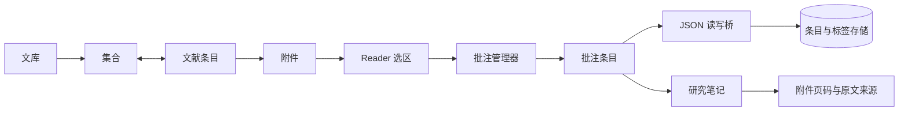

# Zotero 架构映射与本地实现报告

> 分析日期：2026-08-23  
> 报告类型：公开源码架构映射（flavor = null）  
> 目标：Zotero 文库、附件、批注、标签与笔记链路  
> 官方源码版本：主仓库 `786cdea8841d25883193002b69e5b3d09ba7e868`

## 执行摘要

本次分析仅覆盖 Zotero 官方公开仓库及其 `reader`、`note-editor`、`zotero-schema` 子模块，并把结果用于本地论文工作台。核心结论是：Zotero 的批注不是 PDF 上的临时视觉效果，而是隶属于附件的独立条目，带类型、颜色、页码、排序位置、评论、标签、作者和修改时间；reader 通过 JSON 桥接层读写这些条目，笔记编辑器则保留批注来源元数据。当前本地版本已经沿用这条对象与交互链，完成集合和标签范围、五类批注工具、按位置排序、搜索筛选、高亮/下划线转换、加入笔记、移除与撤销，以及“批注 / 笔记 / 标签”检查器。深色侧栏同时改为受控的深松墨色阶，用户色点会先与暗色基底调和，不再直接把明亮奶油色铺到背景底部。当前实现是可交互的前端纵向切片，尚未等同于 Zotero 的 SQLite、同步、真实 PDF 坐标解析和多人协作后端。

## 范围与授权

- 授权与边界：[scope.md](../work/zotero-architecture-study/scope.md)
- 目标：`https://github.com/zotero/zotero` 及官方子模块；本地 `D:/Mycraft/tencent-fight`
- 活动：只读源码映射、交互模型比较、本地界面修复
- 排除：拒绝服务、真实用户钓鱼、无约束数据外传
- 网络模式：`authorized_target_only`

## Evidence

| Evidence | 观察 | 来源 | 复现 |
|---|---|---|---|
| E-001 | 数据库把 items、attachments、annotations、tags、collections 分层并用外键/关联表连接 | `resource/schema/userdata.sql` | 见 [E-001](../work/zotero-architecture-study/evidence/E-001.md) |
| E-002 | `toJSONSync` / `saveFromJSON` 在批注条目与 reader JSON 之间映射类型、正文、评论、颜色、页码、排序、位置和标签 | `xpcom/annotations.js` | 见 [E-002](../work/zotero-architecture-study/evidence/E-002.md) |
| E-003 | reader 按 `sortIndex` 排序，按文本/颜色/标签/作者/类型过滤，并维护 undo/redo | `reader/src/common/annotation-manager.js` | 见 [E-003](../work/zotero-architecture-study/evidence/E-003.md) |
| E-004 | note-editor 用 `data-annotation` 保存高亮/下划线来源，并按批注色渲染 | `note-editor/src/core/schema/nodes.js` | 见 [E-004](../work/zotero-architecture-study/evidence/E-004.md) |
| E-005 | 本地 TypeScript 和 Vite 生产构建通过 | 本地源码 | 见 [E-005](../work/zotero-architecture-study/evidence/E-005.md) |
| E-006 | 固定了分析使用的主仓库与三个官方子模块版本 | Git 提交记录 | 见 [E-006](../work/zotero-architecture-study/evidence/E-006.md) |
| E-007 | 开发服务在排除研究目录与临时补丁目录后返回 HTTP 200 | `vite.config.ts`、本地服务 | 见 [E-007](../work/zotero-architecture-study/evidence/E-007.md) |

## Findings

### F-001 — 文库是规范化对象图，而不是单层论文数组

- severity: `n/a_re`
- category: `design`
- status: `validated`
- evidence_ids: `[E-001, E-002]`
- location: `resource/schema/userdata.sql:158-320`
- confidence: `high`
- impact: 产品信息架构应表达“文库 → 集合 ↔ 条目 → 附件 → 批注”；笔记既可独立，也可带父条目和批注来源。
- remediation: 本地数据层已加入 `collectionIds`、`attachmentId`、`PaperAnnotation`、集合和标签定义。

### F-002 — 批注具有可持久化身份和完整生命周期

- severity: `n/a_re`
- category: `design`
- status: `validated`
- evidence_ids: `[E-002, E-003]`
- location: `xpcom/annotations.js:134-249`; `reader/src/common/annotation-manager.js`
- confidence: `high`
- impact: 高亮按钮必须创建对象，而非仅切换 CSS；对象必须可排序、筛选、转换、保存和撤销。
- remediation: 阅读选区现在创建真实的前端批注记录，并在右侧检查器中支持相应操作。

### F-003 — 从批注进入笔记时必须保留来源

- severity: `n/a_re`
- category: `design`
- status: `validated`
- evidence_ids: `[E-002, E-004]`
- location: `note-editor/src/core/schema/nodes.js:329-454`
- confidence: `high`
- impact: 论文写作中的摘录不能退化为无法回页的纯文本。
- remediation: `ResearchNote` 已加入 `annotationId` 和 `tags`，检查器中的“加入笔记”会保留批注、论文和页码关系。

### F-004 — 当前实现完成了架构纵向切片，但不是 Zotero 后端替代品

- severity: `info`
- category: `other`
- status: `validated`
- evidence_ids: `[E-005, E-007]`
- location: `src/data.ts`; `src/AppV2.tsx`; `src/v2.css`; `tokens.css`; `vite.config.ts`
- confidence: `high`
- impact: 用户可以体验完整的前端对象链和操作反馈；刷新后新增数据仍会复位。
- remediation: 下一层应优先接 SQLite/IndexedDB 持久化和真实 PDF 坐标，再接导入、同步和引用样式。

## Path P-001 — 批注从阅读器进入笔记的调用路径

- path_type: `callflow`
- start: 用户在附件页面选中原文
- goal: 生成可搜索、可回页、可插入笔记的批注记录



1. reader 产生类型、颜色、页码、坐标和 `sortIndex` — evidence: E-003 — finding: F-002。
2. JSON 桥把字段写入以附件为父项的 annotation item — evidence: E-002 — finding: F-001。
3. 标签进入条目标签关系，列表按位置排序并支持筛选/撤销 — evidence: E-001、E-003 — finding: F-002。
4. 加入笔记时保留 `data-annotation` 等来源元数据 — evidence: E-004 — finding: F-003。
5. 本地纵向切片以相同字段完成交互并通过构建与 HTTP 检查 — evidence: E-005、E-007 — finding: F-004。

## 已实现的产品映射

| Zotero 机制 | 本地对应 | 当前状态 |
|---|---|---|
| 集合与条目多对多 | `collectionIds`、集合筛选 | 可点击 |
| 未分类与最近条目 | 文库范围过滤 | 可点击 |
| 条目标签 | 左栏标签、筛选条、论文标签页 | 可增删、可筛选 |
| 附件归属 | `attachmentId` | 已建模 |
| 批注类型 | 高亮、下划线、便签、区域、手写 | 可选择并创建 |
| 批注颜色 | 四个语义色 token | 选区与列表一致 |
| 批注排序与定位 | `sortIndex`、`pageLabel`、`position` | 可排序、可回页 |
| 批注筛选 | 类型、文本、评论、标签、页码 | 可使用 |
| 类型转换 | 高亮 ↔ 下划线 | 可使用 |
| 删除与撤销 | 乐观移除 + 撤销 | 可使用 |
| 批注进入笔记 | `annotationId`、来源论文、页码、标签 | 可使用 |
| 深色主题 | 受控暗色基底 + 用户色点调和 | 已修复 |

## 边界与下一层

当前没有宣称完整复刻 Zotero。以下能力尚需后续分层实现：

1. SQLite 或 IndexedDB 持久化、迁移与事务。
2. 真实 PDF.js 文本层、坐标、区域截图和墨迹路径。
3. DOI、BibTeX、RIS、网页快照和附件导入。
4. 引用样式、字处理器集成和书目生成。
5. 全文索引、同步冲突、组库、权限与多人协作。

## 复现

```powershell
git -C tmp/zotero-study rev-parse HEAD
git -C tmp/zotero-study submodule status reader note-editor resource/schema/global
npm run build
npm run dev -- --host 127.0.0.1
Invoke-WebRequest -UseBasicParsing http://127.0.0.1:5173/
```

完整过程见 [timeline.md](../work/zotero-architecture-study/timeline.md)。
