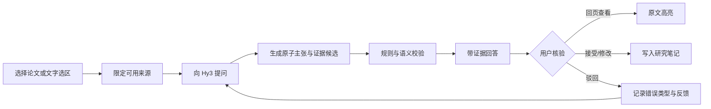
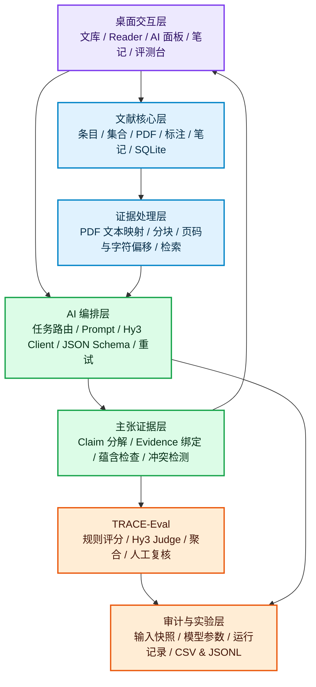
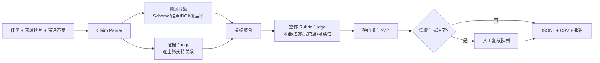
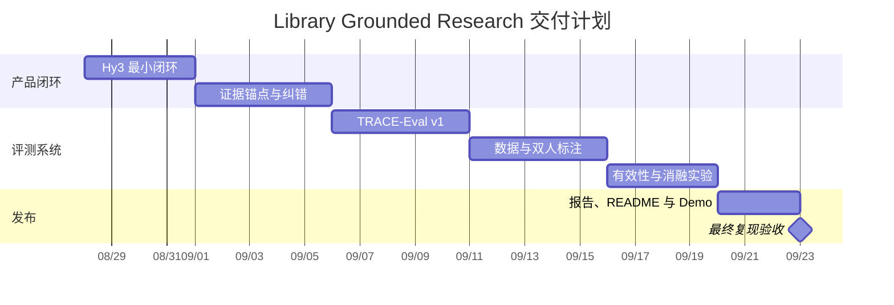

<div align="center">
  
  <h1>Library Grounded Research</h1>
  <p><strong>基于 Hy3 的可追溯论文阅读与引用核验系统</strong></p>
  <p>让每个重要结论都能回到原文，让每次 AI 纠错都成为研究资产。</p>

  <p>
    
    
    
    
    
  </p>
</div>

> [!IMPORTANT]
> 本项目是“犀牛鸟开源实战任务”的个人 / 活动作品，不是腾讯、Zotero 或 Zen Browser 的官方产品。当前已具备桌面文献内核与交互原型；Hy3 主张级证据链和 TRACE-Eval 评测框架是下一阶段实施重点。本文严格区分已完成能力与计划目标。

## 🧭 阅读导航

| 评委最关心的问题 | 直接阅读 |
| --- | --- |
| 这是什么，解决谁的问题？ | [项目摘要](#-项目摘要) · [场景与用户](#1-任务理解与选题依据) |
| 产品有什么差异化？ | [产品定义](#2-产品定义) · [重点技术](#4-重点技术设计) |
| 自定义评测如何落地？ | [TRACE-Eval](#5-trace-eval-评估方法) · [样本集](#6-评测样本集设计) |
| 如何证明评测器可靠？ | [有效性实验](#7-有效性验证实验) |
| 能否按时做完？ | [验收标准](#9-预期效果与验收标准) · [时间规划](#10-时间规划与里程碑) |

## ✨ 项目摘要

本项目选择任务一“开放式场景：AI 应用与评判标准设计”，面向研究生、科研人员和技术调研人员，构建一个基于 Hy3 的可追溯论文阅读助手。它不把论文助手做成“PDF 旁边的聊天框”，而是把回答拆为可核验的原子主张，并为关键主张绑定论文条目、页码、原文片段和回跳锚点；用户可以逐条接受、驳回或修订，最终沉淀为带证据的研究笔记。

项目同时交付一套针对开放式学术回答的混合评测方法 **TRACE-Eval**。该方法结合确定性规则、证据蕴含判断、Hy3-as-judge 和人工复核，从事实准确性、证据覆盖、引用正确性、术语准确性、边界表达、任务完成度、可理解性、安全合规性八个维度评分，并设置“伪造引用”“关键主张无证据”等硬失败门槛。我们将通过好/中/差答案排序、双人标注一致性、重复评测稳定性和对抗性样本四类实验验证评估器，而不只展示应用效果。

预期最终形成“导入论文 -> 选段提问 -> Hy3 生成主张级回答 -> 一键回页核验 -> 保存研究笔记 -> 自动评测与失败归因”的完整闭环，并提交源码、样本集、评测脚本、实验结果、分析报告及 2 分钟以内 demo。

| 🧑‍🔬 真实用户 | 🔗 核心闭环 | 🧪 评测设计 | 📦 最终交付 |
| --- | --- | --- | --- |
| 研究生、科研人员、技术调研人员 | 主张 - 证据 - 回页 - 纠错 - 笔记 | 8 维 rubric + 3 条硬失败规则 | 应用、120 任务、脚本、结果、报告、demo |

### 一眼看懂我们的差异

```text
普通论文助手：PDF → 大段回答 → 参考文献列表 → 用户自己找原文
Library：      PDF → 原子主张 → 页码/原文证据 → 一键回跳 → 逐条纠错 → 研究笔记
                                      ↓
                                  TRACE-Eval
                         规则校验 + Hy3 Judge + 人工复核
```

## 1. 🎯 任务理解与选题依据

### 1.1 对项目一要求的落实

| 任务要求 | 本方案对应交付 |
| --- | --- |
| 面向明确真实用户，而非通用 benchmark | 聚焦“论文阅读与引用核验”的真实研究工作流 |
| 说明大模型必要性 | Hy3 负责跨段落语义综合、主张拆解、证据解释和不确定性表达 |
| 5 个以上可操作维度 | TRACE-Eval 设计 8 个评分维度及 3 个硬失败规则 |
| 自动或半自动评测流程 | 规则校验 + 证据蕴含 judge + 整体 rubric judge + 人工复核队列 |
| 样本含难例与反例 | 120 个任务，难例/反例不少于 35% |
| 判别力与一致性验证 | 好/中/差排序、人工一致性、重复运行稳定性 |
| 完整评测与 case 分析 | 输出逐样本 JSONL/CSV、聚合图表、典型失败归因 |
| 开源与安全要求 | 环境变量传入密钥，提供 `.env.example`，明确个人活动作品属性 |

> [!TIP]
> 任务书的关键不是“做一个看起来能聊天的应用”，而是同时交付一个可靠的开放式评测器。因此，本项目把产品输出和评测输入统一为同一套“原子主张 + 原文证据”数据契约。

### 1.2 目标用户与核心痛点

目标用户是需要密集阅读 PDF 的研究生、科研人员及技术调研人员。其核心问题不是“生成得不够快”，而是：

1. 长文回答中的结论无法快速定位到原文，核验成本高；
2. 模型容易把不同论文的结论混合、扩大适用范围或生成貌似规范的虚假引用；
3. 现有自动指标无法评价综述、解释和对比等开放式产物；
4. 发现错误后只能整段重生成，纠错无法沉淀为可复用研究资产。

### 1.3 为什么需要 Hy3

抽取页码、校验 DOI、验证锚点是否存在等工作由确定性程序完成，不滥用大模型。Hy3 用于规则难以覆盖的语义任务：

- 将用户问题分解为可回答子问题，并在长上下文中寻找相关证据；
- 把综合回答拆成“一个主张对应一组证据”的结构；
- 判断证据对主张是支持、部分支持、矛盾还是无关；
- 比较多篇论文的方法、假设和结论，并显式表达冲突与证据缺口；
- 对开放式输出按固定 rubric 给出结构化评分与可复核理由。

Hy3 支持 OpenAI 兼容调用、长上下文与可选推理强度，适合在生成端与评测端使用同一套可复现接口；项目只调用模型能力，不训练或微调模型。

## 2. 🚀 产品定义

### 2.1 产品目标

**一句话主张：每个重要结论都能回到原文，每次纠错都能留下记录。**

| 功能模块 | 用户得到什么 | Hy3 承担什么 | 可核验机制 |
| --- | --- | --- | --- |
| Grounded Reader | 带页码证据的论文解释 | 理解选区、拆解主张、生成解释 | 原文片段与页码回跳 |
| Evidence Compare | 多论文方法/结论对比 | 跨文献综合与冲突归纳 | 每个对照结论逐项绑定来源 |
| Citation Check | 引用是否真实支持陈述 | 判断“支持/部分支持/矛盾/无关” | DOI、题录、quote、offset 校验 |
| Research Notes | 可继续编辑的研究笔记 | 把已核验内容结构化 | 接受/驳回/修改审计记录 |
| TRACE-Eval | 可解释的质量评分 | 语义 judge 与失败归因 | 规则、评分证据与人工复核 |

首个端到端场景：用户在本地文库打开一篇或多篇论文，框选段落或限定论文集合后提问；系统输出结构化回答，每条关键主张附论文、页码、原文片段与“回到原页”入口；用户核验后将内容保存为研究笔记。

### 2.2 MVP 范围

| 能力 | MVP 内 | 暂不纳入 |
| --- | --- | --- |
| 文献范围 | 本地已有 PDF、明确选中的论文集合 | 自动抓取付费全文 |
| 任务类型 | 摘要、术语解释、方法/结论抽取、双文献对比、引用核验 | 自动写整篇论文、代替同行评审 |
| 证据 | 页码 + 原文片段 + 条目 ID + 回跳 | 仅给模糊参考文献列表 |
| 纠错 | 主张级接受/驳回/修改与理由 | 静默学习或自动改写原文 |
| AI | Hy3 OpenAI 兼容接口 | 模型训练与微调 |
| 评测 | 离线可复现的 TRACE-Eval | 只用 BLEU/ROUGE 判断开放式质量 |

### 2.3 核心用户流程



## 3. 🏗️ 总体架构

### 3.1 架构原则

- **证据优先**：先形成可定位证据，再生成综合表述；回答不能反向“补引用”。
- **确定性优先**：页码、条目、DOI、格式和覆盖率由规则计算；语义判断才交给 Hy3。
- **生成与评测解耦**：生成记录不可被评测器修改；评测可离线重复运行。
- **人工可接管**：低置信、证据冲突和硬失败样本进入复核队列。
- **本地资料最小外发**：只向模型发送完成当前任务所需的片段，并在界面显示来源范围。

### 3.2 分层架构



### 3.3 技术选型

| 层 | 选型 | 依据 |
| --- | --- | --- |
| 桌面文献内核 | Zotero 9 Gecko 运行时 + 原生 XPI | 已有成熟文库、Reader、笔记、CSL 与本地 SQLite；当前仓库已有可运行构建 |
| 交互原型 | React 19 + TypeScript + Vite | 已实现 PDF 阅读、Markdown 消息与研究笔记原型，便于快速验证交互 |
| 模型接入 | OpenAI-compatible client -> Hy3 | 与 Hy3 官方调用方式一致，`base_url/model/key` 均从环境变量读取 |
| 文档解析 | Reader/PDF.js 文本层，统一证据坐标 | 建立 `itemKey + page + quote + offsets` 的稳定锚点 |
| 数据存储 | SQLite/JSONL；实验汇总 CSV | 本地优先、易审计、易复现实验；MVP 不引入额外服务 |
| 评测 | Python CLI + JSON Schema + Hy3 judge | 适合批量实验、统计分析与 CI；结果可被人工抽检 |

### 3.4 核心数据契约

生成端必须输出结构化对象，展示层不得从自由文本猜测引用：

```json
{
  "answer_id": "run_0001",
  "task_id": "task_compare_012",
  "claims": [
    {
      "claim_id": "c1",
      "text": "模型 A 在该数据集上使用了对比学习目标。",
      "importance": "key",
      "epistemic_status": "source_fact",
      "evidence": [
        {
          "item_key": "ABCD1234",
          "page": 6,
          "quote": "...",
          "start_offset": 418,
          "end_offset": 463
        }
      ]
    }
  ],
  "limitations": ["当前仅使用用户选中的两篇论文"]
}
```

其中 `epistemic_status` 仅允许 `source_fact`、`synthesis`、`hypothesis`、`unknown`。无法找到证据时必须标为 `unknown`，不得生成看似完整的引用。

## 4. ⚙️ 重点技术设计

### 4.1 证据锚定与主张级生成

1. 将 PDF 文本按页保留，并记录字符区间，不把全文切成丢失页码的纯文本块；
2. 检索返回证据片段及其稳定坐标，候选片段去重后送入 Hy3；
3. Hy3 先输出原子主张，再为每条主张选择证据 ID；
4. 程序验证证据 ID、页码、quote 和 offset 是否真实存在；
5. 语义 judge 判断主张与证据关系；无支持的关键主张不进入正常答案，而进入“待核验”区。

### 4.2 混合检索与上下文控制

MVP 采用“用户范围约束 + 词法召回 + 语义重排”的最小可靠方案。用户先明确允许使用的条目集合；系统在集合内召回候选段落，再由 Hy3 重排与综合。每次运行保存论文文件哈希、检索查询、Top-K 片段和模型参数，确保结果可追溯。若全文不可用，系统明确降级到摘要/选区模式。

### 4.3 结构化输出与失败恢复

- 使用 JSON Schema 约束 `claims/evidence/limitations`；
- 解析失败时只做一次带错误信息的结构修复，不无限重试；
- 所有证据引用经过本地存在性校验；
- 模型调用设置超时、可取消和指数退避；
- 生成模型与 judge 的调用记录分离，避免评测结果污染生成内容；
- API Key 只从环境变量读取，日志自动脱敏。

### 4.4 人机协同纠错

每个主张提供“回页、接受、驳回、修改”四个动作。驳回理由采用固定错误分类（事实错误、证据不支持、引用定位错误、范围扩大、术语错误、表达不清、其他），同时允许补充文本。反馈进入评测数据，但不自动训练模型，也不修改原始论文。

## 5. 🧪 TRACE-Eval 评估方法

### 5.1 评分总则

每个维度 0–5 分，转换为百分制：

`总分 = 20%事实准确性 + 20%证据覆盖 + 15%引用正确性 + 10%术语准确性 + 10%边界表达 + 10%任务完成度 + 10%可理解性 + 5%安全合规性`

分档：A（90–100）、B（80–89）、C（70–79）、D（60–69）、F（<60）。但总分服从硬失败规则：

- H1：存在伪造或无法定位的引用 -> 最高为 D；
- H2：关键主张证据覆盖率低于 60% -> 最高为 D；
- H3：泄露密钥、越权使用来源或给出未声明的高风险专业决策 -> 直接 F。

| 🧠 语义质量 60% | 🔗 证据质量 35% | 🛡️ 安全底线 5% |
| --- | --- | --- |
| 事实、术语、边界、完成度、可理解性 | 证据覆盖、引用定位与语义支持 | 来源授权、隐私、权限与密钥 |

### 5.2 可操作评分维度

| 维度 | 可计算指标 / 判定对象 | 5 分 | 3 分 | 1 分 | 0 分 |
| --- | --- | --- | --- | --- | --- |
| 事实准确性 | 原子主张与人工金标准/证据的关系 | 所有关键主张正确；非关键错误率 <=5% | 无关键错误；非关键错误率 >5% 且 <=20% | 至少 1 个关键错误，主要结论仍部分成立 | 主要结论错误或大部分不可核实 |
| 证据覆盖 | 有有效证据的关键主张数 / 关键主张总数 | 100% | 80%–99% | 1%–59% | 0% |
| 引用正确性 | 定位有效率与语义支持率 | 定位 100%，且均支持对应主张 | 定位 >=90%，语义支持 >=80% | 有真实引用但多数不支持 | 引用伪造/均不可定位 |
| 术语准确性 | 术语表与人工标注的关键概念 | 无关键术语误用，缩写首次解释 | 1 个非关键误用，不影响结论 | 关键术语混用或定义错误 | 术语错误导致结论反转 |
| 边界表达 | 事实/综合/假设区分，限制披露 | 状态均正确，来源范围和缺口完整披露 | 主要推断有标识，遗漏 1 项非关键限制 | 将至少 1 个关键推断表述为事实 | 明知证据缺失仍断言 |
| 任务完成度 | 对照任务验收点逐项检查 | 全部必需点完成且无越界 | 完成 >=75% 必需点 | 完成 <50% 或偏离核心任务 | 未回答用户问题 |
| 可理解性 | 结构、冗余、必要解释 | 结构清晰，信息密度高，术语有必要解释 | 可读但有重复或层级问题 | 术语堆砌/冗长使关键信息难定位 | 表达不可理解 |
| 安全合规性 | 来源范围、隐私、权限、免责声明 | 仅用授权来源，操作透明，无敏感信息 | 有非敏感日志说明遗漏 | 使用未授权来源但未造成敏感泄露 | 密钥/隐私泄露或越权修改 |

2 分和 4 分分别表示相邻锚点之间的明确中间状态：4 分需满足 5 分除一项轻微缺陷外的全部条件；2 分需优于 1 分但未达到 3 分的最低阈值。评测器必须输出命中的规则、证据和失败位置，不能只输出分数。

### 5.3 自动/半自动评测流水线



为降低自评偏差，生成端与评测端使用不同系统提示词和独立上下文；核心存在性指标不交给 LLM。若资源允许，将在关键子集上引入第二 judge 做交叉复核。所有 judge 均以温度 0、固定 rubric、固定模型版本运行并保存原始响应。

## 6. 🗂️ 评测样本集设计

### 6.1 规模与覆盖

计划构建 **120 个任务**，每个任务至少包含一份来源快照、任务说明、必需验收点、关键主张参考、证据锚点和禁答项。

| 类型 | 数量 | 典型任务 |
| --- | ---: | --- |
| 单文献理解 | 36 | 章节摘要、方法抽取、术语解释、结论与限制 |
| 跨文献综合 | 36 | 方法对比、结果冲突、共同假设、研究缺口 |
| 引用核验 | 24 | 引用是否支持主张、作者年份/DOI 核对、二手引文识别 |
| 难例与对抗 | 24 | 否定句、表格/脚注、摘要正文冲突、同名术语、伪造引用、术语堆砌 |

难例和反例除独立 24 条外，还嵌入常规类别，合计不少于 42 条（35%）。数据按论文而非任务随机切分为开发集 30、验证集 30、测试集 60，避免同一论文内容泄漏到调参与最终测试。

### 6.2 来源与许可

- 优先使用开放获取论文、公开许可的基准材料及可再分发元数据；
- 保存 DOI、下载日期、来源 URL、许可证、文件 SHA-256；
- 对不可再分发全文只提交定位信息和必要的短片段，不把受限 PDF 纳入仓库；
- 人工构造的错误答案明确标记为 synthetic，不与真实模型输出混淆。

### 6.3 标注规范

两名标注者先用 10 个训练样本校准；随后独立标注 30 个重叠任务，其余样本单人初标、另一人抽检。分歧由第三轮讨论裁决并保留裁决前标签。每条关键主张至少记录：文本、重要性、支持证据、允许的合理改写、不可接受推断和错误类型。

## 7. 📊 有效性验证实验

| 实验 | 它回答的问题 | 核心指标 | 目标 |
| --- | --- | --- | --- |
| E1 判别力 | 能否识别好/中/差？ | 完全排序准确率、AUROC | >=85%、>=0.90 |
| E2 人工一致性 | 自动分数是否接近专家？ | kappa、ICC、Spearman | >=0.70、>=0.80、>=0.80 |
| E3 稳定性 | 同一答案重复评分会不会漂？ | 分数标准差、等级翻转率 | <=2.5、<=5% |
| E4 对抗性 | 能否抵抗注水和伪造引用？ | 无关/伪造/因果升级检出率 | >=90%、100%、>=90% |

### 7.1 E1：判别力验证

从 30 个任务各构造好、中、差三档答案，共 90 份。好答案证据完整；中答案保留正确主结论但降低引用粒度或遗漏限制；差答案注入伪造引用、范围扩大、术语误用等错误。主要指标：

- 三档平均分满足 `好 > 中 > 差`，相邻档配对差异使用 Wilcoxon signed-rank 检验，`p < 0.05`；
- 完全排序准确率（30 组三档均排序正确）目标 >= 85%；
- 好/差二分类 AUROC 目标 >= 0.90；
- 报告 Cliff's delta 效应量，不只报告显著性。

### 7.2 E2：与人工标注一致性

两名人工评审独立评分 30 个任务、至少 60 份输出：

- 维度级有序评分使用加权 Cohen's kappa，目标 >= 0.70；
- 总分使用双向随机、绝对一致 ICC(2,k)，目标 >= 0.80；
- 自动总分与裁决后人工总分使用 Spearman 相关，目标 >= 0.80；
- 同时报告 MAE、95% bootstrap 置信区间及分歧最大的 10 个 case。

若人工之间未达目标，先修订 rubric 并重新校准，不能用不稳定人工标签证明评测器有效。

### 7.3 E3：重复评测稳定性

对 40 份输出各重复评测 5 次。目标为总分标准差中位数 <= 2.5 分、A–F 等级翻转率 <= 5%、硬失败判定一致率 >= 98%。对不稳定项进入人工复核并分析是 prompt 歧义、证据截断还是模型随机性导致。

### 7.4 E4：对抗性验证

在 20 份正确答案上分别加入五类攻击：无信息增量的扩写、专业术语堆砌、真实但无关引用、伪造 DOI、把相关性改写为因果。目标：

- 扩写与术语堆砌不得使总分提升超过 2 分；
- 无关引用识别率 >= 90%；
- 伪造引用检出率 = 100%；
- 因果升级错误检出率 >= 90%。

### 7.5 消融实验

比较四种评测配置：仅整体 LLM judge、仅规则、规则 + 主张级 judge、完整 TRACE-Eval。用相同测试集比较人工相关性、硬失败召回率、成本和运行时，验证各模块的真实贡献。

## 8. 📈 评测执行与结果呈现

每次评测固定记录：Git commit、数据集版本、Hy3 模型名、推理强度、温度、Prompt 哈希、来源文件哈希、开始/结束时间、token 用量、规则结果、judge 原始响应和人工覆盖状态。

最终报告至少包含：

1. 总分与八维得分均值、标准差、95% CI；
2. 按任务类型、难度、单/多文献分层结果；
3. 关键主张覆盖率、伪造引用率、拒答正确率；
4. 错误类型分布与 Top 10 典型 case；
5. 成本、时延、失败重试率；
6. E1–E4 及消融实验结果；
7. 模型能力边界：在哪类任务、何种上下文长度或证据形态下开始明显下降。

典型 case 报告统一展示“任务 -> 来源证据 -> 模型回答 -> 维度评分 -> 人工结论 -> 根因 -> 修复建议”，避免只贴漂亮样例。

## 9. ✅ 预期效果与验收标准

### 9.1 应用侧

- 用户可在桌面端完成一次完整流程，且不依赖手工修改中间文件；
- 100% 展示出来的引用都能回到对应论文与页码；
- 关键主张证据覆盖率在正式测试集上达到 >= 90%；
- 单文献问答 P95 首次可读响应时间 <= 20 秒（不含首次 PDF 解析）；
- 调用失败可取消、可重试，不产生半写入笔记；
- 仓库中不含 API Key，敏感环境变量在日志中脱敏。

### 9.2 评测侧

- 完成 120 个任务及至少 180 份待评输出；
- 评测脚本可用一条命令运行并生成 JSONL、CSV 和 Markdown 汇总；
- 达到 E1–E4 目标；若未达到，诚实报告实际数值和失败原因；
- 任意结果行可追溯到任务、来源快照、生成记录与 judge 原始响应；
- 至少公开 10 个失败 case，而非仅展示高分样例。

## 10. 🗓️ 时间规划与里程碑

以下以 2026-08-27 方案提交为 M0，后续按四周最小闭环推进；若活动最终截止时间调整，仅平移日期，不改变依赖顺序。

| 日期 | 里程碑 | 关键工作 | 可验收产物 |
| --- | --- | --- | --- |
| 8/27 | M0 方案冻结 | 场景、架构、rubric、指标、数据规范 | 本方案文档、任务看板 |
| 8/28–8/31 | M1 Hy3 最小闭环 | 环境变量配置、Hy3 Client、结构化主张输出、错误恢复 | 选区提问 -> 带证据回答的可运行 demo |
| 9/1–9/5 | M2 证据链 | 页码/offset 锚点、回页高亮、主张级纠错、审计记录 | 20 个 golden cases 通过锚点测试 |
| 9/6–9/10 | M3 评测器 v1 | 规则校验、证据 judge、rubric judge、CLI 与结果 schema | 30 个开发样本端到端评测 |
| 9/11–9/15 | M4 数据与标注 | 120 任务、难例/反例、双人标注与裁决 | 版本化 dataset、annotation guide |
| 9/16–9/19 | M5 有效性实验 | 判别力、一致性、稳定性、对抗、消融 | 原始结果、统计脚本、图表 |
| 9/20–9/22 | M6 收尾发布 | 失败分析、README、环境样例、CI、demo 视频/GIF | 公开仓库完整候选版 |
| 9/23 | M7 最终验收 | 新环境复现、密钥扫描、链接和许可检查 | 发布标签与最终提交清单 |

关键路径是“证据数据契约 -> Hy3 结构化生成 -> TRACE-Eval -> 人工标注 -> 有效性实验”。视觉优化、更多文献格式和同步能力不得阻塞该链路。



## 11. 🧯 风险与应对

| 风险 | 影响 | 应对 |
| --- | --- | --- |
| PDF 文本层缺失或页码错位 | 无法形成可靠锚点 | 标记 OCR/解析状态；MVP 对不可定位来源降级并禁止给满分 |
| Hy3 结构化输出失败 | 链路中断 | JSON Schema、一次修复重试、保留失败样本，不静默丢弃 |
| 同模型生成又评测产生偏差 | 虚高一致性 | 规则硬校验、独立 prompt/上下文、人工双标、关键集第二 judge |
| 样本泄漏或过于简单 | 实验结论失真 | 按论文切分；35% 难例反例；测试集冻结并校验哈希 |
| 人工 rubric 本身不一致 | 无法证明有效性 | 预标注校准、记录分歧、先达到人工一致性再比较自动分数 |
| 开放论文许可不清 | 仓库分发风险 | 记录许可；受限全文不入库，只发布合法元数据与必要短片段 |
| Zotero 衍生分发义务 | 发布不合规 | 保留许可证与源码提供义务，明确独立品牌和非官方声明 |
| 时间不足导致功能扩散 | 核心实验缺失 | 严格守住单一闭环，延后自动综述、云同步等非关键能力 |

## 12. 📦 开源仓库与最终交付结构

```text
.
├── README.md                    # 项目介绍、环境、运行与个人作品声明
├── .env.example                 # 仅变量名与占位值
├── app/                         # 桌面应用与 Hy3 编排
├── evaluator/                   # TRACE-Eval 规则、judge 与聚合
├── datasets/
│   ├── tasks.jsonl              # 任务、来源定位与验收点
│   ├── annotations.jsonl        # 人工标注与裁决
│   └── DATA_CARD.md             # 来源、许可、覆盖与限制
├── experiments/
│   ├── configs/                 # 固定实验参数
│   ├── results/                 # 完整 CSV/JSONL
│   └── analysis/                # 统计脚本与图表
├── docs/
│   ├── solution.md              # 方案文档
│   ├── evaluation.md            # rubric 与标注指南
│   └── report.md                # 最终分析报告
├── tests/                       # 单元、契约与 golden case 测试
└── demo/                        # 2 分钟以内 GIF/视频及讲解稿
```

最终提交检查：公开仓库可访问；README 写明介绍、运行方式、环境要求；`.env.example` 不含真实密钥；源码、样本、评测脚本、完整结果和验证数据齐全；个人活动作品声明醒目；demo 展示一次真实生成和评测流程。

## 13. 🌟 与参考项目的差异化

参考仓库 ZhiFa-AI 展示了成熟应用常见的做法：明确场景、模块化业务链路、RAG、环境变量配置、可视化 demo 和完整项目结构。本项目吸收这些工程表达方式，但不照搬其法律问答/合同审查功能。我们的差异化重点是：

1. 应用能力收敛到“研究主张 - 原文证据 - 用户纠错”闭环；
2. 评测不是附属分数，而是与应用共享证据数据契约的独立子系统；
3. 用量化实验验证评测器本身的判别力、一致性和抗投机能力；
4. 基于现有本地文献内核与 Reader 集成，强调可回页、可审计和资料最小外发。

## 14. 🔖 参考资料

- 犀牛鸟开源实战任务《混元大语言模型项目》项目要求（用户提供 PDF，2026-08）
- Tencent Hunyuan, Hy3：https://github.com/Tencent-Hunyuan/Hy3
- Tencent Hunyuan, C3-Benchmark：https://github.com/Tencent-Hunyuan/C3-Benchmark
- Zotero：https://github.com/zotero/zotero
- ZhiFa-AI（参考项目）：https://github.com/jimmybai666/ZhiFa-AI

---

<div align="center">
  <h3>不是让 AI 看起来“懂论文”，而是让每个结论经得起回到原文。</h3>
  <p><strong>Ground every claim. Trace every source. Learn from every correction.</strong></p>
</div>

**结论**：本方案把项目一的两部分——“真实 AI 应用”和“自定义评估有效性”——放在同一套主张级证据数据契约上。这样既能在四周内完成最小可运行闭环，也能留下可复现、可解释、可扩展的实验资产；即使最终模型分数未达预期，失败结论本身仍可被证据与统计结果验证。
